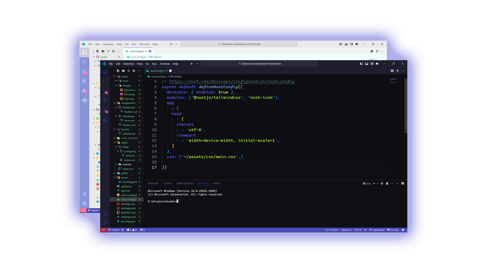
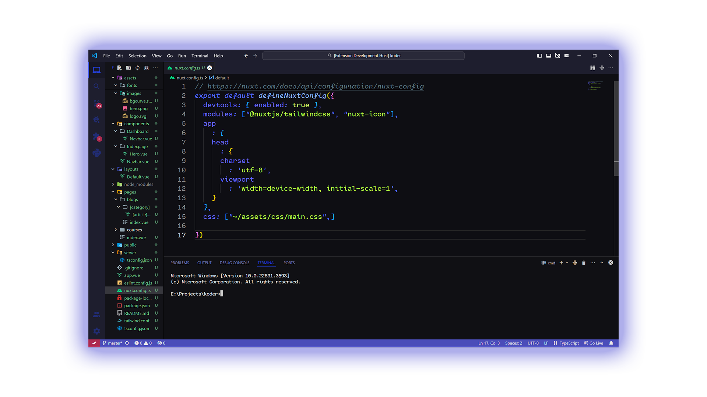
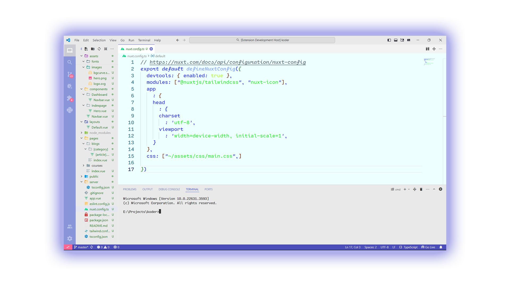

# Blue Mars Theme

 ### Simple theme with vibrant colors, available in both dark and light modes

## Features
- **Vibrant Colors**: Carefully selected colors to enhance your coding experience.
- **Dark and Light Modes**: Seamlessly transition between dark and light themes for any coding environment.
- **Syntax Highlighting**: Enhanced syntax highlighting for improved code readability.
- **Customizable**: Tailor the theme to your preferences with easy-to-use customization options.
- **Readability**: Enhanced readability with a balanced contrast ratio.

## Preview

### Dark Mode

  
Dark Mode Preview

  

### Light Mode

  
Light Mode Preview

  

## Installation

1. Open the Extensions sidebar in VS Code.
2. Search for `Blue Mars Theme`.
3. Click `Install` to add the theme to your VS Code.
4. Click `Reload` to apply the changes.
5. Go to `Preferences` > `Color Theme` > `Blue Mars Theme` to activate it.

## Usage

Easily switch between dark and light modes by selecting `Blue Mars Theme` from the color theme options.

## Recommanded Configration

1. Install [Atom Product Icon Theme](https://marketplace.visualstudio.com/items?itemName=AtomMaterial.a-file-icon-vscode).
2. Use any font from these **(Cartograph CF,Fira Code,Jetbrains Mono)**

## Developer and YouTuber

This theme is developed and maintained by [Naveen Sagar](https://github.com/naveensagar765), a passionate developer and educator.

### Check Out My YouTube Channel

Subscribe to [Naveen Sagar](https://www.youtube.com/@NaveenSagar1) for insightful tutorials and educational content on programming, development tools, and more! Naveen offers tutorials in both Hindi and English languages

## Feedback

We would love to hear your feedback! If you encounter any issues or have suggestions for improvement, please [open an issue](https://github.com/naveensagar765/blue-mars/issues) on our GitHub repository.

## License

This theme is licensed under the MIT License. See the [LICENSE](https://github.com/naveensagar765/blue-mars/blob/main/LICENSE) file for more details.
